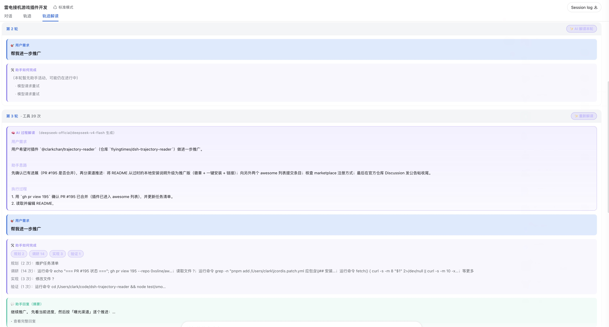

<p align="center"><b>English</b> | <a href="README.zh-CN.md">简体中文</a></p>

# 📖 Trajectory Reader · 轨迹解读 (DSH Web Client Plugin)

[](https://www.npmjs.com/package/@clarkchan/trajectory-reader)
[](LICENSE)
[](https://github.com/flyingtimes/dsh-trajectory-reader)
[](https://github.com/0xsline/awesome-deepseek-harness)

Adds a new **「轨迹解读」 (Trajectory Reader)** tab to the DSH Web GUI conversation view ring (beside 对话 / 轨迹). It segments the session **by user round** and, for each round, highlights what the user wanted and how the assistant fulfilled it — plus an optional **✨ AI process narrative** generated by an LLM for the full think-and-execute story of that round.

## UI Preview

<p align="center">
  
</p>

The screenshot shows the **轨迹解读** tab open in the DSH Web GUI: the conversation header carries the third view tab (对话 / 轨迹 / **轨迹解读**), and the body lists one card per user round. Each round card shows the condensed 🎯 user need, the 🛠 action summary of how the assistant fulfilled it (plan / research / implement / verify / delegate), ⚠ errors and notes, and the 💬 reply digest — while the original user message stays verbatim and expandable, with the full per-tool-call ledger folded away. The ✨ button on a round requests the LLM process narrative (需求 / 思路 / 执行 / 结果) for that round.

## Install (one command, auto-activated)

```sh
# Option 1: from npm (recommended)
dsh plugin --profile web add @clarkchan/trajectory-reader

# Option 2: straight from GitHub
dsh plugin --profile web add "github:flyingtimes/dsh-trajectory-reader#v0.2.3"
```

> The package declares `dsh.bundle.patch`, so `dsh plugin add` **automatically appends it to `dsh.profile.bundles`** — no manual `cordis.patch.yml` editing. After that, restart `dsh web` and the conversation tab bar shows 对话 / 轨迹 / **轨迹解读**.

## Links

- npm package: https://www.npmjs.com/package/@clarkchan/trajectory-reader
- GitHub repository: https://github.com/flyingtimes/dsh-trajectory-reader
- Listed on: https://github.com/0xsline/awesome-deepseek-harness

## Per-round presentation

```
Round N · X tool calls · Y files · Z errors        [✨ AI interpret this round]
├── 🧠 AI process narrative (optional, LLM-generated)
│      ### User need / ### Assistant thinking / ### Execution / ### Result
├── 🎯 User need        one or two sentences distilled by the rules engine (expandable original)
├── 🛠 How the assistant did it   plan/research/implement/verify/delegate action summary
├── ⚠ Errors / notes    failed tool calls, compaction, truncation, retries
├── 💬 Assistant reply (digest)   opening of the reply (expandable full text)
└── ▸ Action details    collapsed per-tool-call ledger
```

- **Round segmentation**: each user message opens a new round; all assistant activity after it belongs to that round. Steering messages mid-execution form their own marked round; orphan activity at session start goes to "session start".
- The rules-based summary is instant and dependency-free; the AI narrative is generated on demand and cached (unchanged material is not re-requested).

## ✨ AI process narrative (LLM summary)

### Architecture

```
browser client.js ──POST /plugin-api/trajectory-reader/summarize──▶ server index.js
      │                                                                    │
      │  { rounds: [{ key, material }] }                                    │ ctx.llm.stream()
      │                                                     system = SYSTEM_PROMPT
      ◀── { ok, route, results: [{ key, ok, text }] } ─────────────────────┘
```

- **Server half (`index.js`)**: activated as a cordis plugin by the web profile Loader row (`inject: ["llm", "webServer"]`), registers an exclusive route:
  - `GET` same path → availability probe (client shows/hides the AI button based on it);
  - `POST` → calls the host `llm` service per round (model route defaults to the current agent default model `agentDefaultModel.currentSelection()`, overridable via request `provider`/`model`), 120s timeout per round, `maxTokens 1200`, at most 12 rounds per request.
  - Each round's material is **JSON-framed** (same injection defense as session-title: user text cannot break the structural delimiters), and every string is recursively length-capped.
- **Client half (`client.js`)**: per-round "✨ AI interpret this round" button plus a top-level "✨ AI interpret all rounds"; results cached by material hash; AI cards render the `###` section headings; a hint tells the user to restart the GUI when unavailable.

### Summarizer prompt (`SYSTEM_PROMPT` in `index.js`)

> You are a "session trajectory interpreter" for DeepSeek Harness (a coding-assistant framework). You receive one round's raw material: the user's original messages, the assistant's replies and thinking excerpts, the ordered tool-call records (names and argument digests), errors and system notes.
> Your job: write a coherent Chinese interpretation of this round — what the user wanted, how the assistant thought and executed step by step, and the final result — so someone who never saw the session can understand what the assistant did and why.
>
> Rules:
> 1. Interpret only from the supplied material; never invent files, commands, conclusions or causes absent from it; if material is truncated ("…"), do not guess the truncated content.
> 2. Output the following Markdown structure (keep the three-# heading lines, in order): `### 用户需求` (one or two sentences…) / `### 助手思路` (…why something was done before something else, how plans adjusted…) / `### 执行过程` (numbered list in actual order…) / `### 结果` (…what was finished, what remains unfinished or failed).
> 3. Emphasize the causal chain of the process (e.g., "read A to confirm B, then modify C to finish D"); do not just list tool names.
> 4. Keep it under 400 characters; wrap file names, commands and error messages in backticks.
> 5. Output only the interpretation — no preamble, no closing remarks, no verbatim re-quoting of the material.

Design notes: the **four fixed sections** mirror the requested need–thinking–execution–result; **no fabrication + no guessing truncated content** keep the interpretation faithful to the trajectory; **causal emphasis** prevents it degrading into a tool list; the **length cap and direct-output format** keep the card readable.

## After enabling (one GUI restart)

After restarting `dsh web`, the 轨迹解读 tab appears; the AI button becomes available once the `GET /plugin-api/trajectory-reader/summarize` probe passes. Client bundle changes apply on page refresh; **server `index.js` changes require a GUI restart**.

## Development & tests

```sh
node --check client.js && node --check index.js
node test/smoke.mjs   # 61 assertions: round splitting / rule classification / material framing / prompt points / route & streaming assembly
```

## Uninstall

```sh
cd "$DSH_HOME/profiles/web" && pnpm remove @clarkchan/trajectory-reader
```

`dsh plugin` automatically removes the package from `dsh.profile.bundles` on uninstall — no manual cleanup needed.
